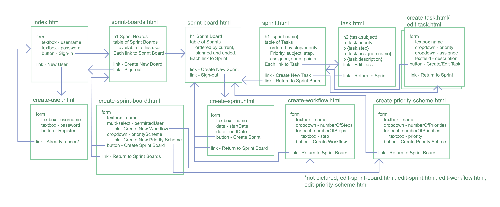

# SprintManager
Java II final project - Team PowerHouse

### Project Architecture

### View Layout

The Sprint Manager helps Agile teams track sprints. A sprint is a number of tasks to be accomplished within a set period of time (usually a week).

The Sprint Manager will allow users to log-in and see their Sprint Boards that they’re permitted to view, or they can create a new one and add users. 

Each Spring Board allows them to choose a current, planned (before start date) or ended (past finish date) sprint. They have the option to create a new sprint, or view one of the existing sprints.

A sprint board is also assigned a priority scheme, and workflow. A priority scheme is a list of priorities (for example High, Medium, Low, Blocker). The priority scheme determines which priorities are available to the tasks of a sprint within a board. 

The workflow determines the steps a task has to take before it’s complete. For example To Do, In Progress, On Hold, and Resolved. 

The priority scheme and workflow allow the creation of sprints to be dynamic, because different teams may choose different priorities and steps.

Each sprint lists the tasks, their subject, step, priority and assignee. Here the user can choose a task to view, create a new task or edit the sprint. A start date and end date determine the duration a sprint takes place.

A task has a subject, description, priority, step, and assignee. The subject is a short description of what needs to be accomplished, while the description allows more details to be added to a task. The priorities available to a task are determined by its sprint’s priority scheme. A task always begins in the first step of a workflow, and as the task is being completed the status will be updated by the user. Ideally, there will be an easy way to update the status from the task UI without editing the whole task. The assignee is a user.

Challenges

•	Figure out how to handle users and encrypt passwords.

•	Dealing with complex joins.

•	Lots of interconnected components and views.

